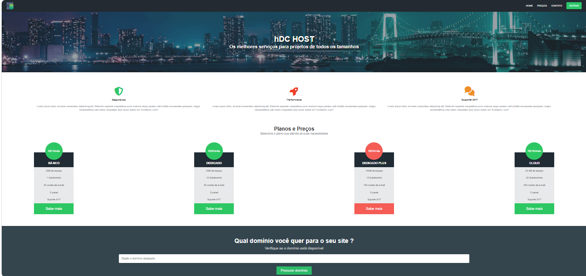

## 📌 Sobre o projeto

O **HDC Host** é um website institucional desenvolvido por mim, para simular uma plataforma de serviços de hospedagem de sites, com foco na apresentação de planos, recursos e captação de clientes.

O projeto apresenta uma interface moderna e organizada, incluindo seções como banner principal, serviços oferecidos, planos e preços, busca de domínio e formulário de contato, proporcionando uma experiência intuitiva ao usuário.

A aplicação foi construída com base em boas práticas de desenvolvimento front-end, priorizando estrutura semântica, organização de layout e responsividade para diferentes dispositivos.

---

## 📷 Pré-visualização

---

## 🚀 Tecnologias utilizadas

- HTML5 (estrutura semântica)
- CSS3
- Flexbox
- Font Awesome (ícones)
- Responsividade

---

## 🎯 Funcionalidades

- Navegação simples e intuitiva
- Apresentação de serviços (segurança, performance e suporte)
- Exibição de planos e preços
- Simulação de busca de domínio
- Formulário de contato

---

## 🎓 Objetivo

Este projeto foi desenvolvido para fins de estudo, com o objetivo de praticar conceitos fundamentais de desenvolvimento web, como estruturação de páginas, estilização com CSS, uso de Flexbox e criação de layouts responsivos.
